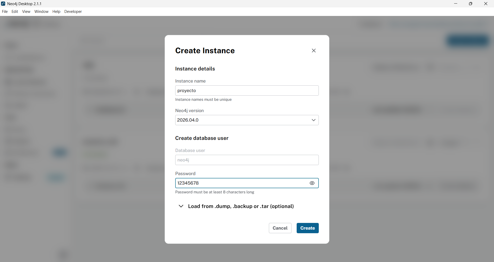
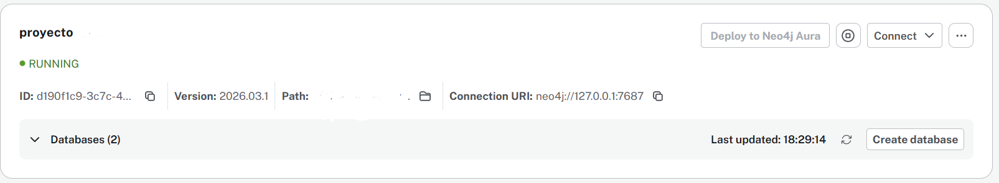
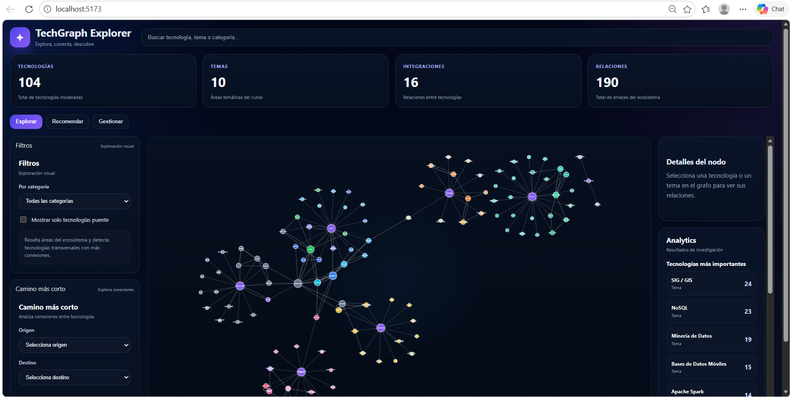

# Manual de Instalación y Despliegue

## 1. Objetivo
Este manual describe cómo preparar el entorno, instalar dependencias, configurar Neo4j y arrancar la aplicación completa (backend + frontend) del proyecto TechGraph-Explorer.

## 2. Requisitos previos
- Windows, Linux o macOS
- JDK 17 o superior
- Maven 3.6+ (opcional si se usa Maven Wrapper)
- Node.js 20.19+ o 22.12+
- npm
- Neo4j en ejecución (Bolt habilitado)

## 3. Estructura relevante del repositorio
- `backend/`: API Spring Boot + Neo4j
- `explorer-ui/`: frontend React + Vite
- `backend/src/main/resources/data.cypher`: script de seed

## 4. Paso 1 - Levantar Neo4j
### 4.1 Crear instancia (si aún no existe)
En Neo4j Desktop:
1. Crear una DBMS/instancia nueva.
2. Definir usuario y contraseña (normalmente usuario `neo4j`).
3. Guardar la configuración.



*Figura 1. Creación de una instancia DBMS en Neo4j Desktop.*


### 4.2 Poner la instancia en ejecución
Iniciar instancia Neo4j (Desktop, servicio o Docker) y verificar:
- Estado `Running` en Neo4j Desktop.
- Bolt activo en `localhost:7687`
- Credenciales válidas



*Figura 2. Verificación de la instancia Neo4j en ejecución (Running).* 


## 5. Paso 2 - Configuración de backend
### 5.1 Crear archivo local de propiedades
Desde la raíz del repositorio:

```powershell
Copy-Item backend/src/main/resources/application-example.properties backend/src/main/resources/application-local.properties
```

### 5.2 Configurar credenciales Neo4j
Editar `backend/src/main/resources/application-local.properties` con valores reales.
La contraseña debe ser exactamente la misma que definiste al crear la instancia Neo4j en el paso 4.1:

```properties
spring.neo4j.uri=bolt://localhost:7687
spring.neo4j.authentication.username=neo4j
spring.neo4j.authentication.password=TU_PASSWORD
```

## 6. Paso 3 - Arrancar backend
Desde `backend/`:

```powershell
.\mvnw spring-boot:run "-Dspring.profiles.active=local"
```

Notas:
- Si el puerto 8080 está ocupado:

```powershell
.\mvnw spring-boot:run "-Dspring.profiles.active=local" "-Dspring-boot.run.arguments=--server.port=8081"
```

- El seed de datos se controla con `app.seed.enabled` en `backend/src/main/resources/application.properties`.

## 7. Paso 4 - Arrancar frontend
Desde `explorer-ui/`:

```powershell
npm install
npm run dev
```

Abrir la URL que muestra Vite (normalmente `http://localhost:5173`).



*Figura 3. Frontend levantado correctamente tras ejecutar `npm run dev`.*

## 8. Verificación rápida de despliegue
1. Backend responde en:
- `http://localhost:8080/api/graph`
- `http://localhost:8080/api/tecnologias`

2. Frontend abre y muestra:
- grafo en panel central
- pestañas superiores (`Explorar`, `Recomendar`, `Gestionar`)


## 9. Problemas comunes
### 9.1 Error de autenticación Neo4j
Mensaje típico: `Neo.ClientError.Security.Unauthorized`
- Revisar usuario/contraseña en `application-local.properties`
- Confirmar credenciales en Neo4j Browser

### 9.2 Error por versión de Node
Si Vite indica versión no compatible:
- actualizar Node a 20.19+ o 22.12+
- reinstalar dependencias en `explorer-ui`

### 9.3 Backend no arranca con `spring-boot:run`
- ejecutar comando desde `backend/`
- usar `./mvnw` o `mvnw.cmd` según entorno

## 10. Script de seed y datos
El archivo `backend/src/main/resources/data.cypher`:
- crea nodos `Tech` y `Tema`
- crea relaciones (`VISTO_EN`, `SE_INTEGRA_CON`, `COMPLEMENTA`, etc.)
- puede reinicializar el grafo si contiene limpieza inicial

En entornos con datos persistentes, validar `app.seed.enabled` antes de arrancar.
