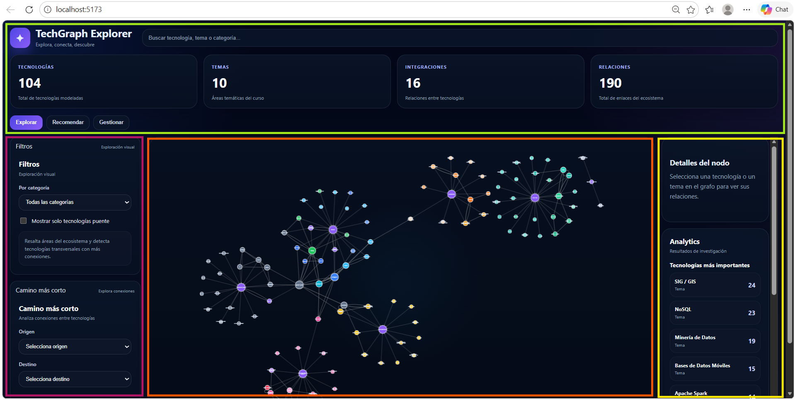

# Manual de Usuario

## 1. Objetivo
Este manual explica cómo usar la interfaz del sistema para explorar el grafo, obtener recomendaciones, analizar relaciones y crear nuevas tecnologías conectadas.

## 2. Pantalla principal
La interfaz se divide en cuatro zonas:
1. Barra superior:
- pestañas de trabajo (`Explorar`, `Recomendar`, `Gestionar`)
- buscador global

2. Columna izquierda:
- paneles plegables según pestaña activa

3. Zona central:
- visualización interactiva del grafo

4. Columna derecha:
- detalle del nodo seleccionado
- panel de analítica

*Figura 1. Vista general de la interfaz principal del explorador de grafo separada por zonas.*

## 3. Pestaña Explorar
Funcionalidades principales:
1. Filtros:
- por categoría
- solo tecnologías puente

2. Camino más corto:
- seleccionar origen y destino
- mostrar ruta entre nodos

Uso recomendado:
1. aplicar filtro inicial
2. calcular camino
3. hacer clic en nodos para inspeccionar detalles

## 4. Pestaña Recomendar
Funcionalidades principales:
1. Recomendaciones por tema:
- seleccionar tema
- ver ranking con score y razones
- visualizar subgrafo recomendado

2. Complementa:
- explorar relaciones `COMPLEMENTA`
- usar tecnología foco para filtrar

Interpretación:
- score alto indica mayor relevancia según reglas del grafo
- razones explican por qué se recomienda una tecnología

## 5. Pestaña Gestionar
Funcionalidad principal:
1. Crear nueva tecnología

Campos del formulario:
- nombre
- categoría
- descripción
- tema
- relaciones (tipo + destino)

Flujo:
1. completar datos obligatorios
2. añadir una o varias relaciones
3. crear tecnología
4. comprobar actualización automática del grafo

Tipos de relación admitidos en el formulario:
- `SE_INTEGRA_CON`
- `COMPLEMENTA`
- `RELACIONADA_CON`
- `COMPITE_CON`
- `ES_ALTERNATIVA_A`

## 6. Interacción con el grafo
1. Arrastrar para desplazar vista
2. Zoom con rueda del ratón
3. Clic en nodo para destacar su vecindad
4. Clic en fondo para limpiar selección

## 7. Buenas prácticas de uso
1. Empezar en `Explorar` para entender estructura general
2. Usar `Recomendar` para identificar tecnologías relevantes por tema
3. Usar `Gestionar` para ampliar el grafo de forma controlada
4. Evitar crear relaciones redundantes sin criterio técnico

## 8. Casos de uso sugeridos
1. Caso 1: elegir stack por tema
- abrir `Recomendar`
- seleccionar un tema
- revisar top recomendadas y sus razones

2. Caso 2: estudiar compatibilidades
- abrir `Recomendar` > `Complementa`
- seleccionar tecnología foco
- analizar conexiones del subgrafo

3. Caso 3: extender conocimiento del grafo
- abrir `Gestionar`
- crear una tecnología nueva
- conectar con tema y tecnologías existentes

